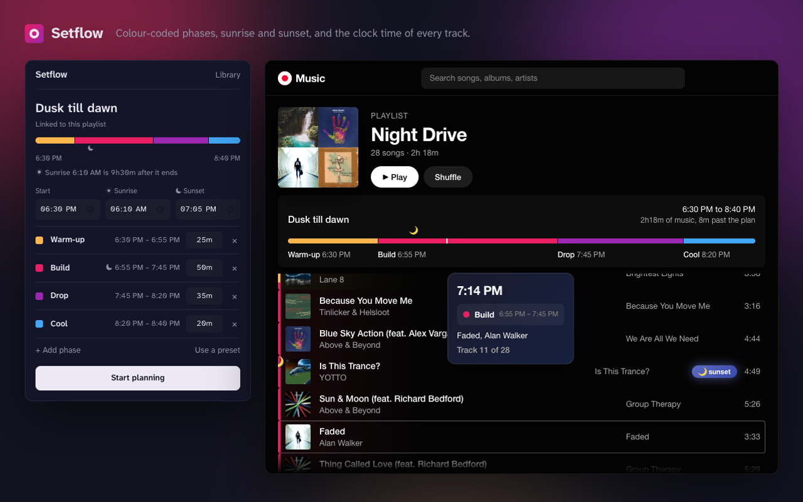

# Setflow

A Chrome extension for YouTube Music that helps you visualize and track journey phases on playlists. Perfect for planning long listening sessions with distinct phases, sunrise/sunset markers, and time simulation.

[](https://chromewebstore.google.com/detail/setflow/fmfegpgkfagkbdaphhncebipgphjdejc)

[](https://chromewebstore.google.com/detail/setflow/fmfegpgkfagkbdaphhncebipgphjdejc)
[](https://chromewebstore.google.com/detail/setflow/fmfegpgkfagkbdaphhncebipgphjdejc)

[](https://setflow.kasvith.me)

Site and live demo: [setflow.kasvith.me](https://setflow.kasvith.me)

## Features

- **Phase Tracking**: Define custom phases with names, durations, and colors
- **Visual Indicators**: Tracks are highlighted with phase colors on YouTube Music playlists
- **Time Simulation**: Hover over tracks to see simulated time progression
- **Celestial Events**: Mark sunrise/sunset times with countdown indicators
- **Library**: Journeys are saved per playlist and reopened from the library; phase presets live alongside them

## Installation

### From the Chrome Web Store (Recommended)

[Add Setflow to Chrome](https://chromewebstore.google.com/detail/setflow/fmfegpgkfagkbdaphhncebipgphjdejc). Updates arrive on their own.

### From GitHub Releases

1. Go to the [Releases](../../releases) page
2. Download the latest `setflow-extension.zip`
3. Extract the zip file
4. Open Chrome and navigate to `chrome://extensions/`
5. Enable "Developer mode" (toggle in top right)
6. Click "Load unpacked"
7. Select the extracted folder

### From Source

1. Clone the repository:
   ```bash
   git clone https://github.com/your-username/setflow.git
   cd setflow
   ```

2. Install dependencies:
   ```bash
   pnpm install
   ```

3. Build the extension:
   ```bash
   pnpm build
   ```

4. Load in Chrome:
   - Open `chrome://extensions/`
   - Enable "Developer mode"
   - Click "Load unpacked"
   - Select the `dist` folder

## Usage

1. Click the Setflow extension icon in Chrome
2. Configure your journey:
   - Set a start time (optional, defaults to now)
   - Customize phases or pick a preset from the library
   - Add sunrise/sunset times if desired
3. Click "Start Planning"
4. Open a playlist on YouTube Music - tracks will be highlighted with phase colors
5. Hover over tracks to see time simulation and phase info

## Development

```bash
# Install dependencies
pnpm install

# Development build with watch
pnpm dev

# Production build
pnpm build

# Type checking
pnpm typecheck
```

## Publishing to the Chrome Web Store

Pushing a `v*` tag builds the zip and creates the GitHub release. When the secrets below exist,
the same run uploads that zip to the Chrome Web Store and submits it for review.

One-time setup:

1. In the [Developer Dashboard](https://chrome.google.com/webstore/devconsole), create the item by
   uploading `setflow-extension.zip` from a release by hand, fill in the listing and privacy tabs,
   and submit it. Note the item ID from its URL and the publisher ID from the account page.
2. Run `npx chrome-webstore-upload-keys` locally and follow it: it creates the Google Cloud
   project, enables the Chrome Web Store API, and prints a client ID, client secret and refresh token.
3. Add repository secrets: `CWS_EXTENSION_ID`, `CWS_PUBLISHER_ID`, `CWS_CLIENT_ID`,
   `CWS_CLIENT_SECRET`, `CWS_REFRESH_TOKEN`.

Every later tag ships to both places. The Web Store version goes live once Google's review passes.

## Tech Stack

- React + TypeScript
- Vite + CRXJS (Chrome Extension build)
- Chrome Extension Manifest V3

## License

MIT
